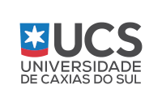

## Sobre

O grupo de usuários de Software Livre Tchelinux, em parceria com a [**Universidade de Caxias do Sul Campus Bento Gonçalves**](https://www.ucs.br/site/vestibular-complementar/bento-goncalves/), tem o prazer de convidar a comunidade para participar do evento que ocorrerá no dia **19 de Outubro de 2019 a partir das 8:30h** no Auditório do Bloco J da UCS em Bento Gonçalves (Alameda João Dal Sasso, 800 - Universitário).

## Inscrições

As inscrições estarão abertas a partir do dia 07 de Setembro, quando a **programação do evento** for anunciada.

O evento tem **entrada franca**, porém os participantes são encorajados a doar 2kg de alimentos não perecíveis (exceto sal), que são doados a instituições de caridade da região.

Os alimentos são recebidos no momento do credenciamento.

<a href="https://bento.tchelinux.org/inscricoes/" style="color:#ff4040"><b><h3>Clique aqui e faça sua inscrição!<h3></b></a>

## Programação

| 
 Horário 
 | 
 Auditório do Bloco J 
 |
|:--------------------------:|:-----------------------:|
| **08:30** <td colspan=1>
**Credenciamento**
 |
| **09:00** <td colspan=1>
**Abertura**  Todo o público  Equipe Tchelinux  
 |
| **09:15** <td colspan=1>
[**Ferramentas Open Source para Ethical Hacking**](#Ferramentas_Open_Source_para_Ethical_Hacking)   Intermediário   Mateus Buogo |
| **10:00** <td colspan=1>
[**Gestão de Redes com SNMP**](#Gestão_de_Redes_com_SNMP)   Principiante   Eduardo Silveira |
| **10:45** <td colspan=1>
[**A importância da arquitetura de infraestrutura**](#A_importância_da_arquitetura_de_infraestrutura)   Intermediário   Marcelo Veriato |
| **11:30** <td colspan=1>
[**Principais motivos pelos quais você precisa ter um backup do seu ambiente**](#Principais_motivos_pelos_quais_você_precisa_ter_um_backup_do_seu_ambiente)   Principiante   Bruna Grellt |
| **12:00** <td colspan=1>
**Intervalo para Almoço**
 |
| **13:30** <td colspan=1>
[**Desenvolvimento web com Django sem dor de cabeça!**](#Desenvolvimento_web_com_Django_sem_dor_de_cabeça!)   Principiante   Adriano Margarin |
| **14:20** <td colspan=1>
[**Porque você deve aprender Rust**](#Porque_você_deve_aprender_Rust)   Principiante   Julio Biason |
| **15:10** <td colspan=1>
**Software Livre na Bling!**   Todo o público   Equipe Bling! |
| **15:30** <td colspan=1>
**Orquestração de Infraestrutura usando CloudStack**   Todo o público   Equipe Adentro |
| **15:50** <td colspan=1>
**Coffee-Break**
 |
| **16:20** <td colspan=1>
[**Vamos matar a Hidra da programação**](#Vamos_matar_a_Hidra_da_programação)   Principiante   Perceu Bertoletti |
| **17:10** <td colspan=1>
[**Porque Flutter?**](#Porque_Flutter?)   Principiante   Vilson Dauinheimer |
| **18:00** <td colspan=4>
**Encerramento**  Todo o público   Equipe Tchelinux   
 |

## Palestras

### Ferramentas Open Source para Ethical Hacking

Palestra sobre Ethical Hacking e as principais ferramentas Open Source disponíveis.

### Mateus Buogo

[**Mateus Buogo**](https://www.linkedin.com/in/mateus-buogo-b0084917/) é Graduado em Redes de Computadores pelo Centro Universitário Faculdade de Tecnologia (Caxias do Sul, 2011) e especialização em MBA Administração de TI pela Universidade do Vale do Rio dos Sinos (São Leopoldo, 2013). Atualmente é Professor do UNIFTEC e Analista de Segurança. Pentester Profissional Certificado DCPT (Desec Certified Penetration Tester). Experiência na área de Segurança da Informação e Infraestrutura de Rede.

### Gestão de Redes com SNMP

Gerenciar ativos de rede pode se tornar complicado à medida que a rede cresce. O Simple Network Management Protocol (SNMP) facilita esse trabalho. Vamos conhecer o SNMP e entender como ele funciona, para ganhar tempo na gestão e prevenir problemas.

### Eduardo Silveira

[**Eduardo Silveira**](http://epsilveira.github.io/) é Bacharel em Sistemas de Informação pela Universidade de Caxias do Sul, trabalha a 12 anos com servidores GNU/Linux, principalmente com gestão de Internet. Admirador do software livre, foi moderador do Viva o Linux durante quase 7 anos, entre 2009 e 2015. Também é podcaster e idealizador do site e podcast [PADD](http://peloamordedeus.org.br).

### A importância da arquitetura de infraestrutura

Explanação sobre a importância da arquitetura de infraestrutura em ambientes corporativos, criando ambientes seguros, escaláveis e tolerantes a falhas. Abordaremos todas as camadas da infraestrutura, desde a rede, segurança, servidores, armazenamento até as camadas de aplicação e usuários. 

### Marcelo Veriato

[**Marcelo Veriato**](https://www.linkedin.com/in/marcelo-veriato-lima-88086582) é CTO da empresa Adentro, trabalha a bons anos com tecnologias de código aberto e infraestruturas complexas. Responsável pela implementação de diversas estruturas de cloud pelo Brasil e exterior. 

### Principais motivos pelos quais você precisa ter um backup do seu ambiente

Nesta palestra vou apontar os 2 principais motivos pelo qual você precisa ter uma cópia de segurança dos seus dados, as ferramentas de mercado que podem te ajudar nesta estratégia e algumas dicas.

### Bruna Martins Grellt

[**Bruna Martins Grellt**](https://www.linkedin.com/in/brunagrellt/) é Customer Success na Adentro Cloud Solutions, empresa de Data Center, na qual está auxiliando o desenvolvimento da Cultura de Sucesso do Cliente em conjunto com a reestruturação de atendimento da equipe de Suporte e Comercial.

### Desenvolvimento web com Django sem dor de cabeça!

Nessa palestra será apresentado uma forma de trabalho com django sem muita dor de cabeça, desde a estruturação do projeto até seu deploy.

### Adriano Margarin

Empreendedor e palestrante, Adriano Margarin divide suas experiências com o intuito de contribuir para a transformação de comunidades de software livre, ideias e atualizações do mercado no cenário da tecnologia.

Graduado em sistemas de informação, é desenvolvedor WEB e atua como consultor no setor. O foco reside em melhoras de desempenho, tempo de execução, expertise e conhecimento em desenvolvimento de software e suas aplicações.

“Hoje, minha maior motivação vem de solucionar problemas e mostrar que não existem limites para quem realmente sonha grande. Temos nos dedos e na mente ótimas ideias para desenvolver e estamos apenas no começo de uma grande jornada chamada de tecnologia”.

### Porque você deve aprender Rust

Rust (a linguagem, não o jogo) é uma linguagem que produz código em que a memória é protegida. Trazendo muitas das funcionalidades de linguagens funcionais, com abstrações de alto nível e performance semelhante a C, Rust é uma linguagem que você realmente deve aprender.

### Julio Biason

[**Julio Biason**](https://functional.cafe/@juliobiason) é programador desde os 12 anos e já conheceu várias linguagens, mas nenhuma que fosse tão interessante quanto Rust.

### Vamos matar a Hidra da programação

Sim quem matou a Hidra foi Hercules, a Meduza não tem 7 cabeça então o trocadilho ficaria ruim, vamos falar de como perder o medo de criar algoritmos, como usar Python, PHP, JavaScript ou qualquer outra linguagem de programação para resolver nossos problemas e como simplificar esses problemas para que não sejam mais um bicho de 7 cabeças.

### Perceu Bertoletti

[**Perceu Bertoletti**](perceu.github.io/me) é Desenvolvedor Web a 6 anos, trabalha com Python, PHP, HTML, CSS, JavaScript e qualquer outra coisa que for preciso. É atuante em comunidades de Caxias do Sul, entusiasta de Desenvolvimento e de Open Source

### Porque Flutter?

Uma pequena introdução sobre o Flutter e porque ele esta sendo adotado por algumas empresas grandes ao redor do mundo.

### Vilson Dauinheimer

[**Vilson Dauinheimer**](https://www.linkedin.com/in/vilsonblanco) é Co-Fundador da [Comunidade Flutterando](https://www.flutterando.com.br/) uma das maiores comunidade de Flutter do brasil. Formado em Análise e Desenvolvimento de Sistemas, sempre foi aficionado por poder tirar algo da sua mente e torna-lo palpável, começou na área Metal-Mecânica transformando barras de ferro em peças, e agora na área de Ti transformando idéias em aplicativos.

## Certificados

Serão fornecidos certificados digitais para os participantes do evento, que confirmaram sua presença. Para obtê-los, você deverá utilizar o email fornecido na sua inscrição para o evento.

**Importante:** Não esqueça de confirmar sua presença no credenciamento.

## Local

> **Universidade de Caxias do Sul Campus Bento Gonçalves**
> Alameda João Dal Sasso, 800 - Universitário
> Bento Gonçalves, RS

  <iframe src="https://www.google.com/maps/embed?pb=!1m14!1m8!1m3!1d4143.881467719476!2d-51.52384751560892!3d-29.147721422452765!3m2!1i1024!2i768!4f13.1!3m3!1m2!1s0x0%3A0x49514de8f745088!2sUCS+-+Universidade+de+Caxias+do+Sul+-+Campus+Universit%C3%A1rio+da+Regi%C3%A3o+dos+Vinhedos!5e0!3m2!1spt-BR!2sbr!4v1563149232905!5m2!1spt-BR!2sbr" width="600" height="480" frameborder="0" style="border:0" allowfullscreen></iframe>

## Apoio

### Institucional

### Patrocínio

### Divulgação

